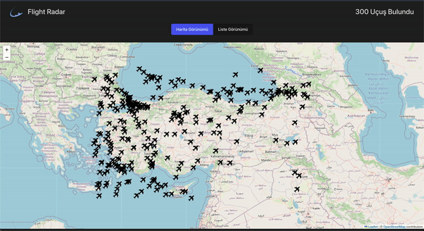

# Flight Radar App

**Flight Radar App** is a React-based application that displays real-time flight data on a map. Users can click on an airplane icon to see more detailed information about the flight, such as its origin and destination.

## Features

- **Flight Tracking**: Real-time flight data is displayed on a map using **Leaflet** and **React Leaflet**.
- **Interactive Map**: Users can click on an airplane icon to view flight details.
- **Flight Information Modal**: A modal appears on the left side when a flight is selected, showing the flight's origin, destination, and other details.
- **State Management**: The application uses **Redux Toolkit** and **React Redux** for managing the global state.
- **Asynchronous Data Fetching**: Flight data is fetched using **Axios**.
- **Responsive Design**: The app is styled with **Bootstrap** for a clean, mobile-friendly user interface.

## Technologies Used

- **React**: JavaScript library for building user interfaces.
- **Redux Toolkit**: State management tool to handle application state.
- **React Redux**: Official Redux bindings for React.
- **Leaflet**: Library for interactive maps.
- **React Leaflet**: React components for **Leaflet** maps.
- **Axios**: For making HTTP requests to fetch flight data.
- **Bootstrap**: CSS framework for responsive design.

